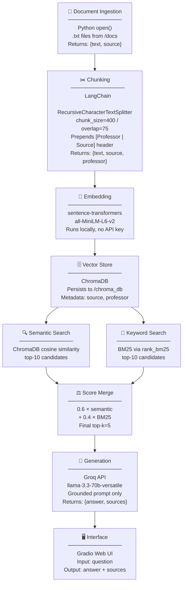

# planning.md — The Unofficial UCI Professor Guide

## Domain

UCI ICS/CS professor and course experiences. More specifically student opinions on professors
like Thornton, Shindler, Wong Ma, and Klefstad across courses like ICS 33, 45C, 46, 51,
and 53.

This knowledge is valuable because it answers things that students want to know like "Does the cs professor
Shindler curve? Is cs professor Wong Ma worth the difficulty? What does Thornton's grading
actually look like going into the final?" The official course catalog gives you prerequisites
and units. But it doesn't tell you how it is like or the many opinions and suggestions that people have for those professors/courses.
Students share this knowledge on Reddit and RateMyProfessors, but it is not searchable in one place like this.

---

## Documents

All 10 sources are saved as .txt files in the /docs folder. Each file was manually copied
from its source because both Reddit and RateMyProfessors block automated scraping.

| # | File | Source URL | Type | Content |
|---|------|-----------|------|---------|
| 1 | reddit_ics33_thornton_curve.txt | reddit.com/r/UCI/comments/14ac2rz | Reddit thread | Thornton curve details, grade going into final, passing thresholds |
| 2 | rmp_thornton_reviews.txt | ratemyprofessors.com/professor/13200 | RMP reviews | Thornton class structure, vibes, student suggestions |
| 3 | rmp_shindler_reviews.txt | ratemyprofessors.com/professor/2512998 | RMP reviews | Shindler grade curve, difficulty, exam style |
| 4 | reddit_ics46_shindler_ics53_wongma.txt | reddit.com/r/UCI/comments/dzgshs | Reddit thread | One student's take on taking Shindler + Wong Ma together |
| 5 | rmp_wongma_reviews.txt | ratemyprofessors.com/professor/2409085 | RMP reviews | Wong Ma reviews: difficulty, what you learn, grading |
| 6 | reddit_wongma_shindler_comparison.txt | reddit.com/r/UCI/comments/13kt0jd | Reddit thread | Debate: Wong Ma hard but you learn more vs. easier alternatives |
| 7 | rmp_klefstad_reviews.txt | ratemyprofessors.com/professor/17490 | RMP reviews | Klefstad reviews: teaching quality, complaints, overall impressions |
| 8 | reddit_klefstad_weird.txt | reddit.com/r/UCI/comments/ait0f5 | Reddit thread | Klefstad negative/unusual classroom experiences |
| 9 | thornton_ics46_course_reference.txt | ics.uci.edu/~thornton/ics46/CourseReference.html | Official course page | Thornton ICS 46 structure: grading breakdown, policies, expectations |
| 10 | reddit_ics51_wongma.txt | reddit.com/r/UCI/comments/n50u8g | Reddit thread | ICS 51 with Wong Ma: workload, difficulty, student experiences |

Sources span three types: Reddit threads (personal student stories), RMP
review pages (structured individual ratings), and one official course reference page. This
variety means the system can answer both factual questions (grading breakdown from the
syllabus) and experiential questions (what students actually felt about surviving the class).

---

## Chunking Strategy

**Strategy:** Recursive character text splitting, splitting on paragraph boundaries first,
then sentence boundaries, then spaces, then characters as a last resort.

**Chunk size:** 400 characters. **Overlap:** 75 characters.

**Why recursive splitting fits these documents:**

The documents are a mix of Reddit comments (2–5 sentences each), RMP reviews (1–4
sentences each), and one longer course overview page with structured paragraphs. A fixed
character split would cut mid-sentence or merge two different students' opinions into one
chunk. Recursive splitting respects the boundaries of both the opinion of a redditor and a paragraph section in the course reference document. It keeps these context distinct chunks
intact wherever possible.

**Why 400 characters:**

A RMP review or Reddit comment is 200–500 characters. A 400 character chunk
captures one complete opinion without merging unrelated viewpoints. Smaller chunks (under
150 characters) will produce fragments with no context about
which class or why those fragments match too many queries and return noise. Larger chunks
(over 800 characters) would merge multiple student opinions into one embedding, making it
impossible for retrieval to match a specific claim about grading or difficulty. This is an experimental variable.

**Why 75 characters of overlap:**

Reddit threads have replies which does not repeat some important context like the professor or class taken. A reply saying "The curve saved me" is meaningless
without the comment it answered. A 75 character overlap carries just enough of the prior
sentence into the next chunk to make the reply retrievable on its own. It is small enough
not to duplicate full opinions across chunks. This is an experimental variable.

**Metadata header prepended to each chunk:**

Every chunk gets a header like [Professor: Thornton | Source: rmp_thornton_reviews.txt]
added to its text before embedding. This ensures professor names and course identifiers are always present in the chunk text, so queries containing professor names or courses retrieve correctly even from review text that never repeats the professor's name.

**Expected chunk count:** With 10 documents averaging 1,500–3,000 characters each after
cleaning, and a chunk size of 400 with 75 overlap, the expected total is roughly 80–150
chunks within the suggested project chunk count.

**Diagnosing bad chunks:**
- Too small: retrieval returns vague fragments like "he's tough" with no professor or
  course context.
- Too large: retrieval returns chunks mixing opinions about multiple professors or courses,
  giving the LLM contradictory context to summarize.

---

## Retrieval Approach

**Embedding model:** all-MiniLM-L6-v2 via sentence-transformers. Runs entirely locally
with no API key and no rate limits, which fits the free tool stack required by this project.

**Vector store:** ChromaDB, persisted locally to a /chroma_db folder. Metadata stored per
chunk: source filename and professor name.

**Retrieval method:** Hybrid search combining semantic similarity and BM25 keyword search.
This is implemented as the core pipeline (not deferred as a stretch feature) because professor names like "Shindler," "Wong Ma," and "Klefstad" are needed context that semantic search alone can miss. A query for "does Shindler curve?" may semantically match chunks about any hard professor who curves but not specifically Shindler. BM25 treats
the professor name as a hard keyword signal. The hybrid approach satisfies both the
required semantic search feature and the hybrid search stretch feature.

**Score merging:** final_score = 0.6 x semantic_score + 0.4 x BM25_score. This is an experimental variable.

Semantic search is weighted higher because most queries are phrased conversationally. Which means semantic score should be weighed higher. BM25 is weighted lower to be like a tie breaker when course names or professors are mentioned.

**Implementation:** Semantic search retrieves top-10 candidates from ChromaDB. BM25 via
rank_bm25 retrieves top-10 candidates from the full chunk corpus in memory. Scores are
normalized to the same scale before merging. Final top-5 results are passed to generation.

**Top-k = 5:** Five chunks gives the LLM enough context to synthesize an answer across
multiple students opinions without focusing on unrelated material. If eval
tests show relevant chunks being missed, this will be tuned up.

**Why semantic search finds relevant chunks without exact word matches:** The embedding
model maps phrases like "Thornton is tough but fair" and "hard grader who curves at the
end" to nearby points in vector space because they share meaning, even if zero words
overlap with the query "does Thornton curve grades?"

**Production tradeoffs (if cost were not a constraint):**
- text-embedding-3-large (OpenAI) — higher accuracy on short opinion text, but adds
  per-token cost and API dependency.
- instructor-xl — allows query-type prefixing for better domain-specific matching, but
  slower and heavier to run locally.
- A multilingual model (e.g., multilingual-e5) is needed because there are a considerable amount of  international students.

---

## Evaluation Plan

Each question is specific enough that a grader can judge whether the system's response is
accurate, partially accurate, or inaccurate without subjective interpretation.

| # | Question | Expected Answer |
|---|----------|-----------------|
| 1 | Does Thornton curve ICS 33? | Yes — students on Reddit report that a low score going into the final can still result in a passing grade due to a curve. Specific grade ranges are mentioned in the thread. |
| 2 | Is Wong Ma worth taking even though he is hard? | Mixed — many students say yes because you genuinely learn the material deeply and it prepares you for later courses. Others recommend easier alternatives if GPA is the priority. Both positions appear in the Reddit comparison thread and RMP reviews. |
| 3 | What is Shindler's grading structure like in ICS 46? | Exam-heavy with a curve. Students report that practicing Shindler's specific problem sets is the key to passing. Multiple RMP reviews mention the curve explicitly. |
| 4 | Is Wong Ma a tough professor for ICS 51? | Yes — students consistently describe Wong Ma as one of the harder ICS professors. Reviews note heavy workload and difficult exams, but many add that the difficulty pays off in how well you understand the material afterward. |
| 5 | Is taking ICS 51 with Wong Ma and ICS 45C with Shindler in fall a good idea compared to ICS 46 and ICS 51 with Nicolau in winter? | Mixed, students say that Wong Ma and Shindler together is a very heavy load since both are demanding. Some suggest splitting them across quarters. No clear concensus.

---

## Anticipated Challenges

**1. Reply-without-context problem in Reddit threads.**
A reply "same, I barely passed" is not helpful without the comment it
responds to. The 75-character overlap helps but will not fully solve deeply nested threads.
Mitigation: when manually copying Reddit threads into .txt files, include the parent post
text at the top of each reply block so the context is embedded in the file itself before
chunking.

**2. Professor name missing from chunk.**
An RMP review might say "the curve saved my life" without ever naming the professor — that
context lives in the page title or filename, not the review body. If the chunk loses that
context, retrieval for "does [professor] curve?" will miss it. Mitigation: the metadata
header [Professor: X | Source: filename.txt] prepended to every chunk ensures the
professor name is always present in the chunk text that gets embedded.

**3. Cross-professor contamination in comparison threads.**
Reddit threads comparing Shindler and Wong Ma contain opinions about both professors. A
chunk from that thread may get retrieved for queries about either professor, even when only
one is relevant. Mitigation: store source_file as metadata in ChromaDB and surface it
in every response so users can judge the source context themselves.

---

## AI Tool Plan

Claude will be used to implement all five pipeline stages. For each stage, the relevant
planning.md sections plus the pipeline diagram will be provided as context. The AI is being
used to scaffold code from a detailed spec.

**Stage 1 – Ingestion (ingest.py):**
Input to Claude: the Documents section of this file, the folder structure (/docs with .txt
files), and the requirement to clean navigation text and boilerplate.
Expected output: a load_documents() function that reads all .txt files from /docs, strips
whitespace and formatting artifacts, and returns a list of {"text": str, "source": filename}
dicts. Will verify by printing one loaded document and checking it looks clean.

**Stage 2 – Chunking (chunk.py):**
Input to Claude: the Chunking Strategy section and the Documents section.
Expected output: a chunk_documents() function using a pure-Python recursive character
splitter. Implements
the algorithm: chunk_size=400, chunk_overlap=75, separators ["\n\n", "\n", ". ", " ",
""] in order. Function parses professor name from filename and prepends the metadata header
to each chunk. Verified: 455 chunks, 0 empty, 0 fragments, all 5 samples readable and
self-contained.

**Stage 3 – Embedding and Storage (embed.py):**
Input to Claude: the Retrieval Approach section and the Architecture diagram.
Expected output: an embed_and_store() function that loads all-MiniLM-L6-v2, embeds each
chunk, and upserts into a ChromaDB collection called "uci_professors" persisted to
/chroma_db. Metadata fields: source and professor. Includes try/except for malformed
chunks. Will verify by checking ChromaDB collection count matches expected chunk total.

**Stage 4 – Retrieval (retrieve.py):**
Input to Claude: the Retrieval Approach section and the Architecture diagram.
Expected output: a retrieve() function that embeds the query, runs ChromaDB semantic
search for top-10, runs BM25 via rank_bm25 for top-10, normalizes and merges scores at
0.6/0.4, and returns the top-5 results with text, source, professor, and merged score.
Will verify by running 3 evaluation questions and checking returned chunks visibly relate
to the question with distance scores below 0.5.

**Stage 5 – Generation and Interface (generate.py + app.py):**
Input to Claude: the full Architecture diagram, the grounding requirement (answer only
from retrieved context, refuse if not enough info), and the Gradio skeleton from the
project instructions.
Expected output: a generate_answer() function that formats top-5 chunks into a grounded
prompt, calls Groq API with llama-3.3-70b-versatile loaded from .env, and returns
{"answer": str, "sources": list}. Also a Gradio app.py with a question textbox input and
answer + sources textbox outputs. Will verify grounding by asking a question not covered
by any document and confirming the system refuses to answer.

---

## Architecture

